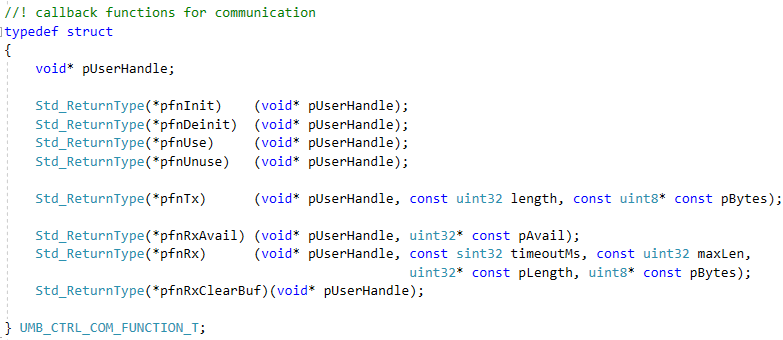
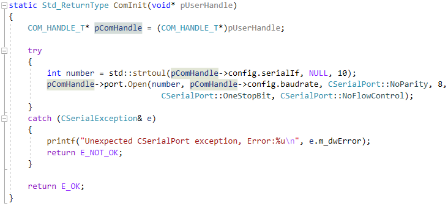
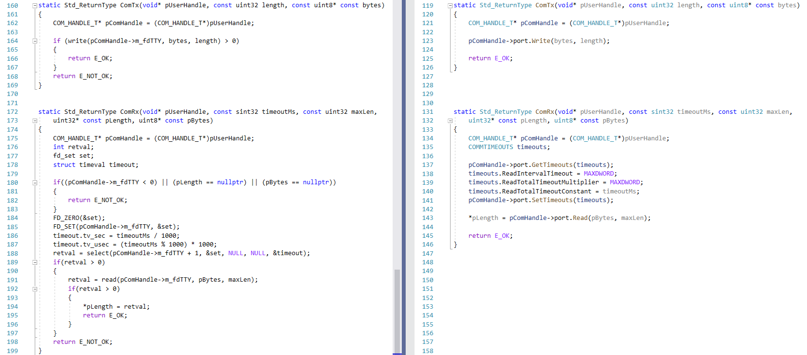
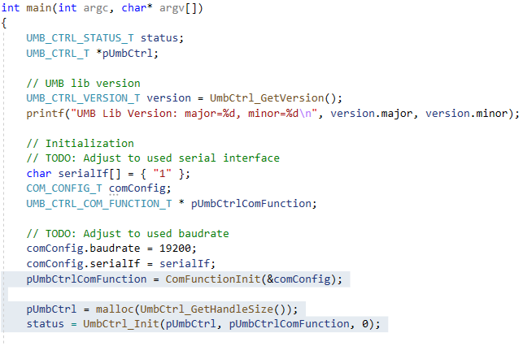
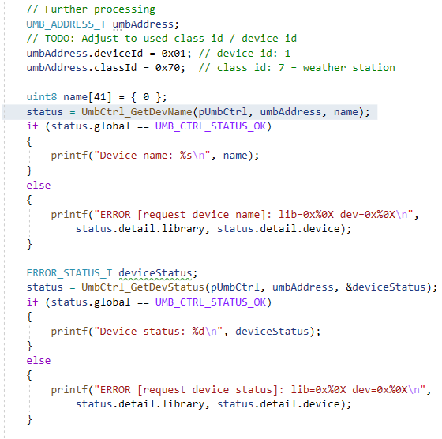
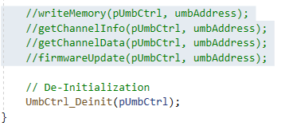

# Content {#content .TOC-Heading}

[Change History - 2 -](#_Toc71192989)

[1 The UMB Protocol - 3 -](#_Toc71192990)

[2 The UMB Library - 3 -](#the-umb-library)

[3 Scope of Delivery - 3 -](#scope-of-delivery)

[4 Commissioning - 4 -](#commissioning)

[5 Usage - 4 -](#usage)

[5.1 System Connection - 4 -](#system-connection)

[5.2 Initialization - 7 -](#initialization)

[5.3 Test Programm - 8 -](#test-programm)

[6 Notes on Firmware Update - 9 -](#notes-on-firmware-update)

# The UMB Protocol

The UMB protocol is an open binary protocol specified by the Lufft
company for the configuration and data retrieval of measuring devices.

The current version of the specification can be found in the download
area of ​​the homepage [www.Lufft.de](http://www.Lufft.de). The document
contains all information on the frame structure and timing as well as a
detailed description of all commands.

# The UMB Library

The functions specified in the UMB protocol are implemented in the UMB
library. The library is written in the C language and is available for Windows
and Linux. It does not use dynamic memory allocation.

The commands of the UMB protocol listed in Table 1 are implemented in the library.

|  <cmd> |  Description                       |     Library V0.4 |
| ------ | ---------------------------------- | ---------------- |
|  20h   |  Hardware and software version     |                  |
|  21h   |  Read out EEPROM                   |     x            |
|  22h   |  Write EEPROM                      |     x            |
|  23h   |  Online data request               |                  |
|  24h   |  Reset / default                   |     x            |
|  26h   |  Status request                    |     x            |
|  27h   |  Set time / date                   |                  |
|  28h   |  Read out time / date              |                  |
|  2Bh   |  Protocol change                   |                  |
|  2Ch   |  Last fault message                |                  |
|  2Dh   |  Device information                |     x            |
|  2Eh   |  Reset with delay                  |                  |
|  2Fh   |  Multi-channel online data request |     x            |
|  30h   |  Set new device ID temporarily     |                  |
|  36h   |  UMB-Tunnel                        |                  |
|  37h   |  Transfer Firmware                 |     x            |
|  38h   |  Transfer Binary Data              |                  |

# Scope of Delivery

The folder \"**lufft**\" contains all files that are required to use the
UMB library:
-   Software libraries for Windows and Linux / Linux on ARM

|        | windows                      | linux                      | linux/ARM                |
| ------ | ---------------------------- | -------------------------- | ------------------------ |
| 64 bit | UmbControllerLib.lib         | libUmbController.a         | libUmbControllerArm_64.a |
| 32 bit | UmbControllerLib_32.lib      | libUmbController_32.a      | libUmbControllerArm_32.a |

The header files to use the library: 
* UmbControllerLib.h: Interface of the library 
* Umb_Types.h: General type definitions

In the “src” folder you will find files with examples for connecting the library to your own system:
* UmbCtrlTest.cpp: Test program to illustrate how it works
* ComWin.c/.h: Example implementation for connection under Windows
* ComLinux.c/.h: Example implementation for connection under Linux

The \"**win**\" folder contains non-Lufft files that are used in the
test program or in the example implementations under Windows. The terms
of use specified in the respective source files must be observed here.

The "**examples**" folder contains an example for installing the library
on a RaspberryPi. Further examples are planned.

# Commissioning

To use the UMB library, the two header files Umb_Types.h and
UmbControllerLib.h must be copied into your own project.

Dependent on the system in use (Windows, Linux, Linux on ARM) the
respective library is required, see also chapter 3.

The installation instructions for a RaspberryPi can be read separately
in the README.txt file in the /examples/RaspberryPi directory.

# Usage

The current functional scope of the library can be found in the
interface file UmbControllerLib.h.

## System Connection

The serial interface is controlled via function pointers that are
defined in the UMB_CTRL_COM_FUNCTION_T structure, see Figure 1.

{width="6.299305555555556in"
height="2.7354166666666666in"}

Figure 1 Structure with function pointers for controlling the serial
interface

The function pointers (\*pfnInit) and (\*pfnDeinit) are optional and
e.g. can be used to open or close the serial interface. However, if this
is already done elsewhere, the two function pointers can also be set to
NULL.

All other function pointers are mandatory and must be implemented.

The function pointers (\*pfnUse) und (\*pfnUnuse) are intended for the
protection of variables or code segments by semaphores. In the current
example implentations these functions do not include active code.

The handle \*pUserHandle can be used to pass user-specific data on to
the callback functions. In the example implementations comWin.cpp and
ComLinux.cpp, all data that are required during operation are summarized
in a structure COM_HANDLE_T. \*pUserHandle points to the address of such
a data record, which means that this data is then available in the
callback functions. Figure 2 shows the initialization of a
\*pUserHandle, Figure 3 the subsequent application.

{width="6.299305555555556in"
height="1.8680555555555556in"}

Figure 2 Initialization of a \*pUserHandle

{width="6.100528215223097in"
height="2.8085772090988628in"}

Figure 3 Usage of a \*pUserHandle

The modules ComLinux.cpp/.h and ComWin.cpp/.h show examples of how the
assignment of these function pointers can be implemented:

The control of the serial interface is implemented directly in ComLinux,
whereas ComWin uses third-party software (SerialPort.h) for which only
the wrapper functions compatible with the UMB library are provided, see
also Figure 4.

{width="10.90625in" height="4.697916666666667in"}

Figure 4 Implementation examples for controlling the serial interface:\
left: Example for Linux, manual implementation\
right: Example for Windows, Usage of already existing implementation

## Initialization

The initialization of the UMB library comprises 3 points:

-   Allocation of the function pointers to control the serial interface

> For the sake of clarity, it is best to assign the required function
> pointers in a separate function defined by the user, see section 5.1.

-   Provision of the handle

> The UMB library does not use dynamic memory allocation. Therefore, the
> user must provide the memory for the library instances used.
>
> This handle is required when calling all other functions of the UMB
> library.

-   Calling the initialization function of the library

> The handle and the variable that contains the function pointers, must
> be given to the initialization function UmbCtrl_Init().

Figure 5 shows an example of the initialization sequence, Figure 6 a
query of the device name and the device status.

{width="5.358798118985127in"
height="3.550307305336833in"}

Figure 5 Initialization of the UMB library

{width="4.6670713035870515in"
height="4.633734689413823in"}

Figure 6 Query of device name and device status

## Test Programm

The test program in UmbCtrlTest.cpp shows an example of how to use the
UMB Controller library. Before using the test program, all places marked
with \'TODO\' in the main() program must be adapted to your own test
system. These are

-   Preprocessor definition \_USE_NCURSES, in order to be able to use
    the graphical progress display for the update function under Linux
    (for more details see below)

> #define \_USE_NCURSES

-   Used serial interface, e. g.

> char serialIf\[\] = { \"3\" };
>
> Note:
>
> Under Linux, the entire path of the serial interface must be specified
> here, e.g.
>
> char serialIf\[\] = { \"/dev/tty03\" };

-   Baud rate of the serial interface, e. g.

> comConfig.baudrate = 19200;

-   UMB address of the UMB device to be used for communication, e.g.

> umbAddress.deviceId = 0x01; // device id: 1
>
> umbAddress.classId = 0x70; // class id: 7 = weather station

-   Path and name of the firmware file, e.g.

> char fileName\[\] = {
> \"C:\\\\Projekte\\\\UmbController\\\\WS100_update.bin\" };

The functions that have been commented out (see Figure 7) are best
transferred into the test program individually and as required in order
to become familiar with the respective functionality.

{width="2.9419214785651793in"
height="1.3167804024496939in"}

Figure 7 Example functions for using the UMB library

**About the preprocessor definition_USE_NCURSES**

The example implementation firmwareUpdate() uses a graphical
representation of the update progress, which requires the ncurses
package under Linux. This must be installed manually e. g. on a
RaspberryPi, since it is not preinstalled via raspbian-stretch-lite.

Instructions for this can be found in the README.txt file in the
/examples/RaspberryPi directory.

If this progress display is to be used, the preprocessor definition
\_USE_NCURSES must be set after the ncurses package is installed. If, on
the other hand, this instruction is commented out, a simple progress
display is used instead of the graphical one, which does not require any
further packages.

# Notes on Firmware Update

Older UMB devices such as WSx00, Ventus, Anacon etc. use an update file
in .mot format. These cannot be transferred to a device via the UMB
protocol, but only via Hexload.

Therefore for the new generation of UMB devices such as MARWIS, WS1000,
WS100, SHM31 and others the .bin file format was defined, which also
enables a firmware update via UMB.

-   Firmware updates via the UMB protocol are only possible for UMB
    devices whose update file is in .bin format
